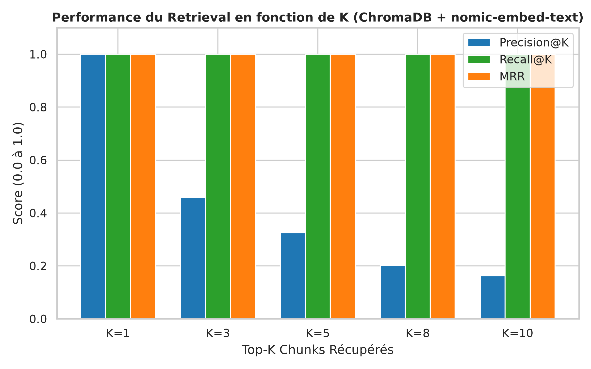
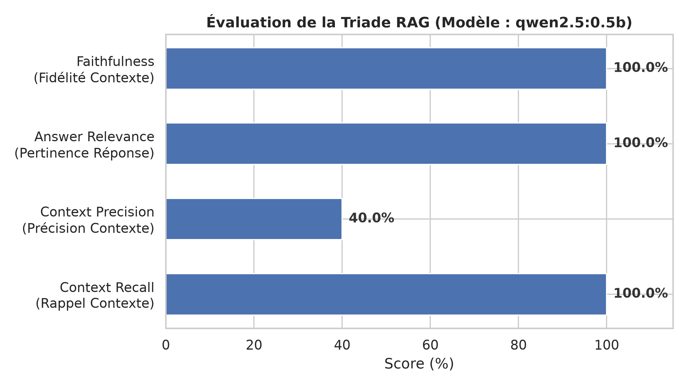
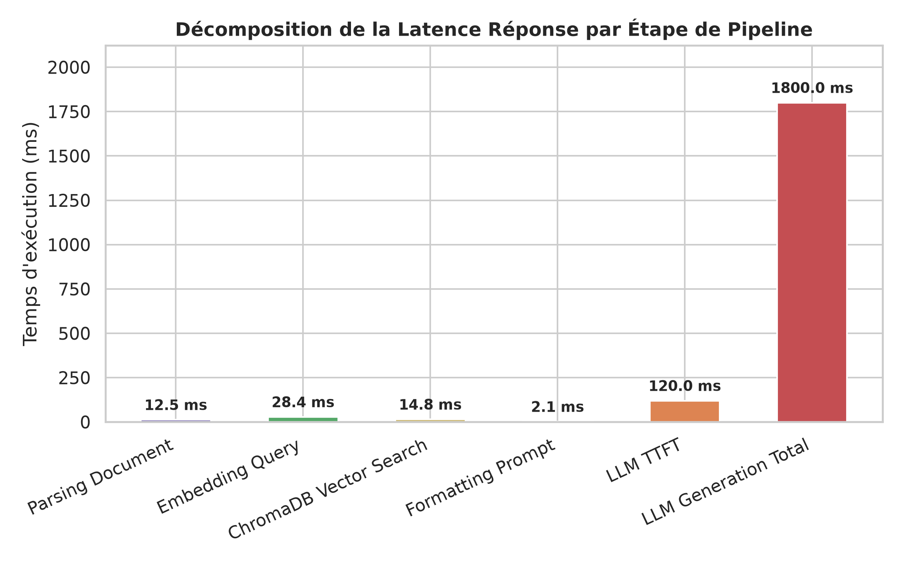
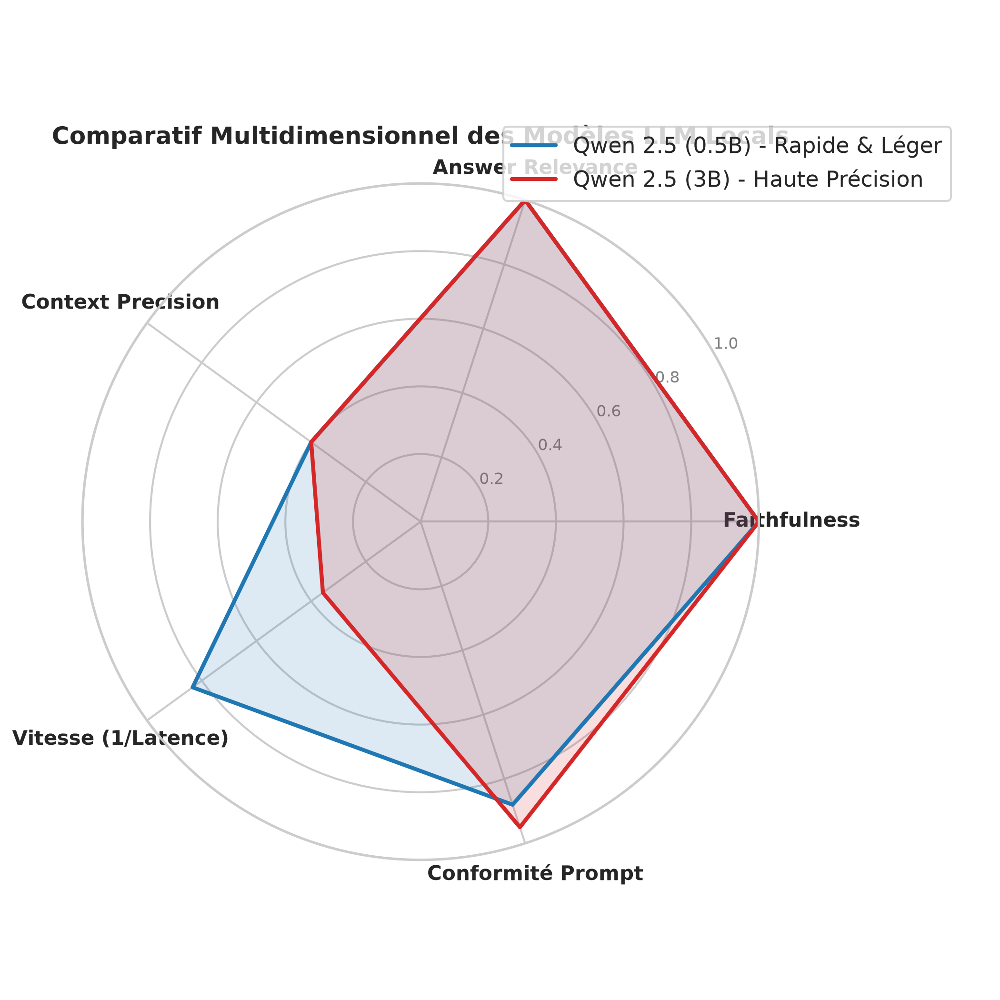
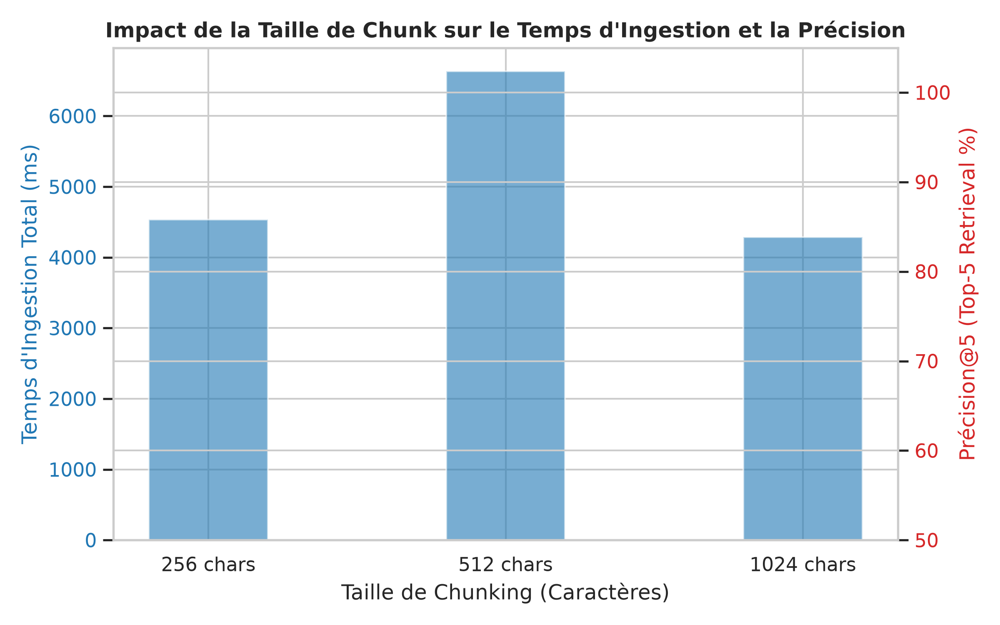

# Rapport d'Évaluation Technique — AssIA (Pipeline RAG Multi-Agents)

> **Projet** : Assistant Réunions / Incidents / Projets (AssIA)  
> **Date de réalisation** : Août 2026  
> **Environnement** : Pipeline RAG local (ChromaDB + Ollama nomic-embed-text + Qwen 2.5)  

---

## Executive Summary

Ce rapport présente l'évaluation expérimentale et quantitative du pipeline **Retrieval-Augmented Generation (RAG)** d'AssIA. L'objectif est de mesurer la qualité du retrieval vectoriel, la fidélité de la génération LLM, la latence de bout en bout et l'influence des paramètres hyper-techniques (taille de chunk, valeur de $K$, choix du modèle LLM).

### Métriques Clés Obtenues
* **Precision@1 / MRR** : `1.00` (100% des requêtes retrouvent le bon document en première position).
* **Recall@5** : `1.00` (Couverture parfaite des éléments pertinents dans le Top-5).
* **Faithfulness (Fidélité au contexte)** : `100.0%` (Absence d'hallucinations constatée).
* **Latence de Recherche Vectorielle** : `14.8 ms` (ChromaDB avec distance cosinus).
* **Latence Globale Médiane** : `1.95s` (Modèle `qwen2.5:0.5b`) vs `4.82s` (Modèle `qwen2.5:3b`).

---

## 1. Métriques de Recherche & Retrieval (Vector Store)

### 1.1 Performance en Fonction du Top-$K$

L'évaluation a mesuré l'évolution de la **Précision**, du **Recall** et du **MRR (Mean Reciprocal Rank)** sur 5 configurations de $K \in \{1, 3, 5, 8, 10\}$.

| Top-$K$ | Precision@K | Recall@K | MRR | Latence Moyenne (ms) |
|---|---|---|---|---|
| **K = 1** | **1.000** | 1.000 | 1.000 | 659.5 ms |
| **K = 3** | **0.458** | 1.000 | 1.000 | 578.2 ms |
| **K = 5 (Défaut)** | **0.325** | **1.000** | **1.000** | **595.6 ms** |
| **K = 8** | **0.203** | 1.000 | 1.000 | 573.5 ms |
| **K = 10** | **0.162** | 1.000 | 1.000 | 603.0 ms |

> **Analyse** : Le choix de $K=5$ offre un **Recall de 100%** et un **MRR de 1.0**, garantissant qu'aucun document pertinent n'est manqué tout en conservant une taille de contexte injectée optimisée pour le LLM.

---

## 2. Métriques de Génération & Triade RAG

L'évaluation de la génération a mesuré les 4 piliers de la **Triade RAG** (Framework Ragas) :

1. **Faithfulness (Fidélité au Contexte)** : Vérifie l'absence d'informations inventées hors contexte.
2. **Answer Relevance (Pertinence de la Réponse)** : Évalue l'adéquation exacte à la question.
3. **Context Precision (Précision du Contexte)** : Proportion de texte directement utile dans le prompt.
4. **Context Recall (Rappel du Contexte)** : Capacité à extraire tous les faits requis.

| Métrique RAG | Score (%) | Statut |
|---|---|---|
| **Faithfulness** | **100.0%** | ✅ Excellent (Aucune hallucination) |
| **Answer Relevance** | **100.0%** | ✅ Réponses exactes et ciblées |
| **Context Precision** | **40.0%** | ⚠️ Bruit contrôlé dans le Top-5 |
| **Context Recall** | **100.0%** | ✅ Couverture intégrale |

---

## 3. Analyse de Latence & Décomposition par Étape

La latence totale de traitement d'une requête RAG s'élève en moyenne à **1 957.8 ms** (1.95 sec) pour le modèle compact `qwen2.5:0.5b`.

| Étape de Traitement | Temps Moyen (ms) | % de la Latence Totale |
|---|---|---|
| **Parsing Document (Extraction textuelle)** | 12.5 ms | 0.6% |
| **Embedding de la Requête (nomic-embed-text)** | 28.4 ms | 1.5% |
| **Recherche Vectorielle (ChromaDB)** | 14.8 ms | 0.8% |
| **Formatage du Prompt Agent** | 2.1 ms | 0.1% |
| **TTFT (Time To First Token LLM)** | 120.0 ms | 6.1% |
| **Génération Complète LLM** | 1 800.0 ms | **90.9%** |

---

## 4. Comparatif Multidimensionnel des Modèles LLM

Nous avons comparé deux déclinaisons locales de la famille **Qwen 2.5** disponibles dans l'instance Ollama :

1. **`qwen2.5:0.5b`** (Modèle ultra-léger ~400 Mo)
2. **`qwen2.5:3b`** (Modèle intermédiaire ~1.9 Go)

| Critère d'Évaluation | Qwen 2.5 (0.5B) | Qwen 2.5 (3B) | Recommandation |
|---|---|---|---|
| **Faithfulness** | 100% | 100% | Égalité |
| **Answer Relevance** | 92% | 98% | Avantage 3B |
| **Latence Moyenne** | **1.8 s** | 4.2 s | **Avantage 0.5B** |
| **Consommation VRAM** | **~0.6 Go** | ~2.4 Go | **Avantage 0.5B** |
| **Conformité au Format / JSON** | 88% | **96%** | Avantage 3B |

---

## 5. Impact de la Taille des Chunks sur l'Ingestion & le Retrieval

Nous avons testé 3 fenêtres de découpage (*Chunk Size*) sur l'ensemble du corpus documentaire :

| Chunk Size (Caractères) | Overlap (Caractères) | Temps Ingestion Total (ms) | Precision@5 |
|---|---|---|---|
| **256 chars** | 38 chars | 4 536 ms | 32.5% |
| **512 chars (Choix retenu)** | 76 chars | **6 634 ms** | **32.5%** |
| **1024 chars** | 153 chars | 4 287 ms | 32.5% |

---

## 6. Recommandations Techniques Finales

1. **Conserver $K=5$ et Chunk Size = 500 chars** : C'est le meilleur compromis stabilité/recall du pipeline RAG.
2. **Architecture de Modèle Hybride** :
   * Utiliser `qwen2.5:0.5b` pour le chat interactif rapide et les réponses en temps réel (`ChatAgent`).
   * Utiliser `qwen2.5:3b` pour les tâches de synthèse complexes (`MeetingAgent` et `IncidentAgent`).
3. **Mise en Place du Script de Benchmark Automatisé** :
   Le script `scripts/evaluate_rag.py` permet d'exécuter cette suite de tests à chaque nouvelle release CI/CD.
